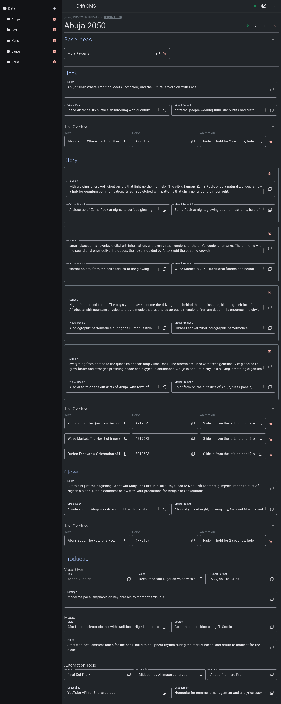

# ScriptMS

ScriptMS is a lightweight, open-source system designed to help manage and generate scripts for faceless channel brands. It focuses on crafting imaginative, culturally rich stories set in futuristic worlds, specifically imagining Nigerian cities in the future. This tool blends local traditions with cutting-edge technology to envision what cities might become, streamlining the creative process for content creators. ScriptMS combines an Express backend with an Angular frontend, designed for local deployment and customization by anyone passionate about creative storytelling.

---

## Features

- **Hierarchical Content Management**: Organize futuristic city narratives into a structured hierarchy (e.g., cities > years > scripts).
- **Editable JSON Script Files**: Store scripts as timestamped JSON files, allowing easy editing and versioning.
- **Responsive Web Interface**: Navigate seamlessly on any device with a collapsible navigation drawer.
- **Script Management Tools**: Add, edit, copy, and regenerate scripts to support iterative creative processes.
- **Local File System Storage**: Ensure persistence and accessibility of your work without relying on external databases.
- **Groq Integration**: Generate scripts using a powerful AI prompt that creates all aspects of a script given just the city, year, and optional base ideas.
- **Production Notes**: Include voice-over, music, and automation details for a complete production pipeline.
- **Afro-Futurist Aesthetic**: Focus on hope, resilience, and innovation, incorporating Nigerian cultural motifs and avoiding dystopian themes.

---

## Screenshot (Demo)

<p align="center">
  
</p>

---

## Technical Overview

### Backend

- **Framework**: [Express.js](https://expressjs.com/)
- **Features**:
  - RESTful API for managing scripts and hierarchical content.
  - Socket.IO integration for real-time updates.
  - File system operations for reading, writing, and deleting JSON files.
  - Groq integration for AI-powered script generation.

### Frontend

- **Framework**: [Angular](https://angular.io/)
- **Features**:
  - Responsive design with Material Design components.
  - Dynamic forms for editing script content.
  - Localization support using `@ngx-translate/core`.
  - Theme switching (light/dark mode).
  - Real-time updates via Socket.IO.

---

## Installation

### Prerequisites

- Node.js (v16 or later)
- Angular CLI (v20 or later)
- A modern web browser

### Steps

1. Clone the repository:

   ```bash
   git clone https://github.com/newben420/scriptms.git
   cd ScriptMS
   ```

2. Install dependencies:

   ```bash
   cd scriptms
   npm install
   ```

3. Configure environment variables:

   - Create a .env file in the root directory.
   - Add the following variables, and update according to your specifications:

     ```sh
     PORT="3000"
     TITLE="ScriptMS"
     BRAND="Drift"
     PRODUCTION="true"
     FORCE_FAMILY_4="true"
     EXIT_ON_UNCAUGHT_EXCEPTION="true"
     EXIT_ON_UNHANDLED_REJECTION="false"
     PROD_URL="https://example.com"
     MAX_ALLOWED_FLOG_LOG_WEIGHT="5"

     GROQ_KEY=""
     GROQ_ENDPOINT="https://api.groq.com/openai/v1/chat/completions"
     GROQ_MODELS="deepseek-r1-distill-llama-70b"
     # allam-2-7b compound-beta compound-beta-mini deepseek-r1-distill-llama-70b gemma2-9b-it
     # llama-3.1-8b-instant llama-3.3-70b-versatile llama3-70b-8192 llama3-8b-8192
     # meta-llama/llama-4-maverick-17b-128e-instruct meta-llama/llama-4-scout-17b-16e-instruct
     # meta-llama/llama-guard-4-12b meta-llama/llama-prompt-guard-2-22m
     # meta-llama/llama-prompt-guard-2-86m mistral-saba-24b qwen-qwq-32b qwen/qwen3-32b
     GROQ_REQUEST_TIMEOUT_MS="0"
     GROQ_MAX_RETRIES="4"
     GROQ_HTTP_TIMEOUT_MS="60000"
     GROQ_MAX_HISTORY_COUNT="5"

     DATA_POSTSTRING="default"
     ```

### Usage

1. Start the application:
   ```bash
   npm start
   ```

2. Access the application at http://localhost:3000/. Or whatever port you specify.

3. Workflow:
    - **Add Cities**: Navigate to the "Data" section and create a new city.
    - **Add Years**:  Within a city, add specific years to organize your scripts.
    - **Generate Scripts**:  Use the Groq-powered AI to generate scripts by providing a city, year, and optional base ideas.
    - **Edit Scripts**:  Modify generated scripts directly in the editor.
    - **Production Notes**:  Add voice-over, music, and automation details for a complete production pipeline.

---

## Project Structure

- **`/engine/`**: Core logic for data management, Groq integration, and socket communication.

- **`/lib/`**: Utility functions and helpers.

- **`/model/`**: Type definitions for structured data (e.g., scripts, visuals).

- **`/site.js`**: Configuration and environment variables.

---

## Contributions

Contributions are welcome! If you have ideas for new features or improvements, feel free to open an issue or submit a pull request.

---

## License

This project is open-source and available under the MIT License.